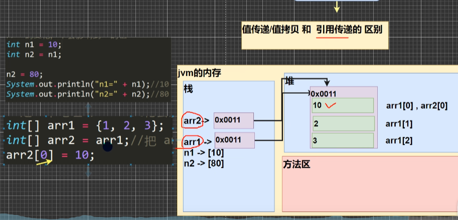
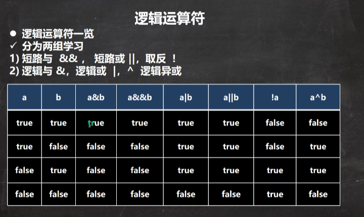

### 整型细节

### 重点章节

1. String 465开始
2. 集合 499
3. 泛型 553
4. 反射 711
5. 线程 579
6. IO流 614
7. 网络编程 661
8. jdk源码 319

### java数据类型

#### 数组

1. 数组创建后，如果没有赋值，又默认值
    1. int 0
    2. short 0
    3. byte 0
    4. long 0
    5. float 0.0
    6. double 0.0
    7. char \u0000,
    8. boolean false
    9. String null

2. 数组定义

```java
class Test {
    public static void main(String[] args) {
        // 1.
        int[] a = {1, 2, 3};
        int b[] = {1, 2, 3};
        int[] c; // 1. 声明
        c = new int[5];//分配空间，存的是默认数值
       c[0] = 1;// 2. 赋值，3. 使用
       // 数组的下标/索引，最小值是0 ，最大值是length -1.
    }
}
```
3. 数组赋值机制
   1. 在内存里面只要分配数据空间，一定有一个地址
   2. 数组拷贝的地址，指向同一个数字空间
   3. 
   4. 只要是new一个对象一定会在堆中开辟新的空间

#### 整数类型


1. java的整型常量（具体值）默认为int，申明long型常量须后加 "l" 或者 “L”
2. java程序中变量声明为int，除非不足以表示大数，才使用long
3. bit：计算机中的最小储存单位，byte：计算机中基本存储单元，1byte = 8bit
4. java各整数类型有固定的范围和字段长度，不受具体OS(系统)影响

--------

#### 浮点类型

浮点类型


1. java各浮点类型有固定的范围和字段长度，不受具体OS(系统)影响
2. java的浮点型常量（具体值）默认是double型，声明float型常量，须后加"f" 或 ”F“；如 float num=1.2 会报错
3. 浮点型常量有两种表示形式
    1. 十进制形式：如： 5.12 512.0f .512
    2. 科学计数法形式 如：5.12e2 =>[5.12 *10^2]=512.0 5.12E-2=>[5.12/10^2]=0.00512
4. 通常情况下，应该使用double型，因为它比float更精确
5. 浮点数使用陷阱： num1=2.7 和 num2=8.1/3 =2.999999999997 比较; **重点**当我对运算结果是小数的进行相等判断事，要小心；应该事以两个数的差值的绝对值，在某个精度范围内判断

```
double num1=2.7;
double num2=8.1/3;
if (Math.abs(num1 - num2) < 0.000001) {
    System.out.println("差值非常小，到规定精度，认为相等 ");
}
```

#### 字符类型（char）

1. 字符类型可以表示单个字符，字符类型是char，char是两个字节（可以存放汉字），多个字符我们用字符串String

```java
class Test {
    public void test01() {
        char c1 = 'a';
        char c2 = '\t';
        char c3 = '韩';
        char c4 = 97; // => 输出 97对应的字符 a 
    }
}
```

2. 字符细节
    1. 字符常量是单引号（''）括起来的单个字符，如 char C1='b';
    2. java中还允许使用转移字符'\' 来将其后的字符转变为特殊字符型常量，例如：char = '\n';表示换行符
    3. 在java中，char的本质是一个整数，在输出时，是unicode码，对应的字符
    4. 可以直接给char赋一个整数，然后输出时，会按照对应的unicode字符输出
    5. char类型可以进行运算的，相当于一个整数，因为它都对应有unicode
3. 自动类型转换
    1. 当java程序再进行赋值或者运算时，精度小的类型自动转换为精度大的数据类型，这个就是自动类型转换。
    2. 数据类型按精度（容量）大小排序为（背）

```java
/**
 *
 char -> int -> long -> float ->double 
 byte -> short -> int -> long -> float -> double
 */
// int n2 = 1.1 ;// 错误 double -> int

```

4. 自动类型转换注意和细节
    1. 有多种类型的数据混合运算时，系统首先自动将所有数据转换成容量最大的那种数据类型，然后再进行计算。

```java
   public class AutoConvertDetail {

    //编写一个main方法 public static void main(string[] args) {

    //有多种类型的数据混合运算时，
    //系统首先自动将所有数据转换成容量最大的那种数据类型，然后再进 int n1 = 10; //ok 
    //float d1 = n1 + 1.1;//错误 n1 + 1.1 => 结果类型是 double
    //double d1 = n1 + 1.1;//对 n1 + 1.1 => 结果类型是 double 
    float d1 = n1 + 1.1F;//对 n1 + 1.1 => 结果类型是 float

}

```

2. 当我们把精度（容量）大的数据类型赋值给精度（容量）小的数据类型时，就会报错，反之就会进行紫红类型转换。
3. （byte，short）和char之间不会互相自动转换。

```java
class Test {
    public static void main(String[] args) {
        byte b1 = 10;// 对， 数值赋值（1）先判断该数是否再byte范围内，如果时就可以
        int n2 = 1;
        byte b2 = n2; // 错误，原因：如果是变量赋值，判断类型   
        char c1 = b1;//错误，原因 byte不能自动转换成char
    }
}

```

4. byte、short、char他们三者可以计算，只要参与运算，在计算时首先转换为int 类型 byte+byte=int
5. boolean 不参与转换
6. 自动提升原则，表达式结果的类型自动提升为操作数种最大的类型

#### 逻辑运算符

1. 逻辑运算符一览表
   
