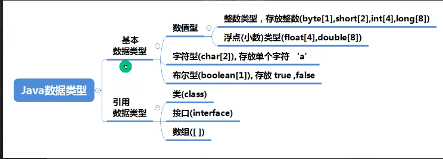
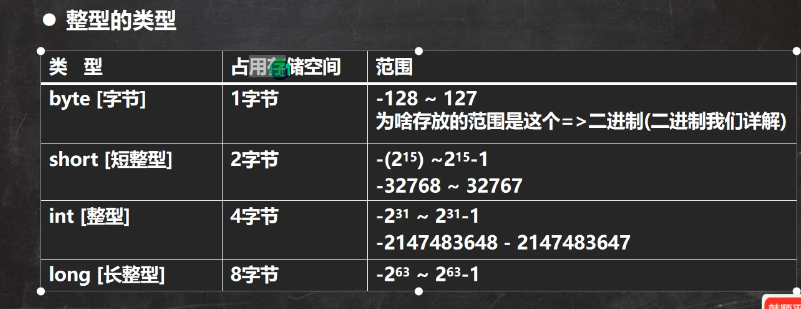
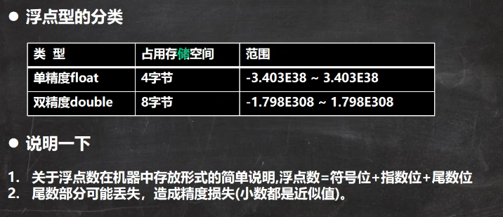

### 整型细节
### java数据类型

#### 整数类型


1. java的整型常量（具体值）默认为int，申明long型常量须后加 "l" 或者 “L”
2. java程序中变量声明为int，除非不足以表示大数，才使用long
3. bit：计算机中的最小储存单位，byte：计算机中基本存储单元，1byte = 8bit 
4. java各整数类型有固定的范围和字段长度，不受具体OS(系统)影响
--------
####  浮点类型
浮点类型

1. java各浮点类型有固定的范围和字段长度，不受具体OS(系统)影响
2. java的浮点型常量（具体值）默认是double型，声明float型常量，须后加"f" 或 ”F“；如 float num=1.2 会报错
3. 浮点型常量有两种表示形式
    1. 十进制形式：如： 5.12 512.0f .512
    2. 科学计数法形式 如：5.12e2 =>[5.12 *10^2]=512.0  5.12E-2=>[5.12/10^2]=0.00512
4. 通常情况下，应该使用double型，因为它比float更精确
5. 浮点数使用陷阱： num1=2.7 和 num2=8.1/3 =2.999999999997 比较; **重点**当我对运算结果是小数的进行相等判断事，要小心；应该事以两个数的差值的绝对值，在某个精度范围内判断
```
double num1=2.7;
double num2=8.1/3;
if (Math.abs(num1 - num2) < 0.000001) {
    System.out.println("差值非常小，到规定精度，认为相等 ");
}
```
#### 字符类型（char）
1. 字符类型可以表示单个字符，字符类型是char，char是两个字节（可以存放汉字），多个字符我们用字符串String

```java
class Test {
   public void test01() {
      char c1 = 'a';
      char c2 = '\t';
      char c3 = '韩';
      char c4 = 97; // => 输出 97对应的字符 a 
   }
}
```
2. 字符细节
   1. 字符常量是单引号（''）括起来的单个字符，如 char C1='b';
   2. java中还允许使用转移字符'\' 来将其后的字符转变为特殊字符型常量，例如：char = '\n';表示换行符
   3. 在java中，char的本质是一个整数，在输出时，是unicode码，对应的字符
   4. 可以直接给char赋一个整数，然后输出时，会按照对应的unicode字符输出
   5. char类型可以进行运算的，相当于一个整数，因为它都对应有unicode

